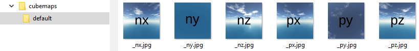
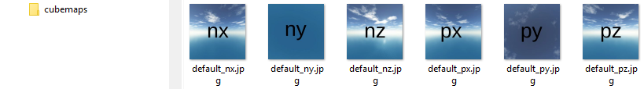

# CubeTexture

Environment mapping that uses the six faces of a cube as the map shape.

## Resources
* [https://doc.babylonjs.com/classes/3.1/cubetexture](https://doc.babylonjs.com/classes/3.1/cubetexture)

## Required

You need to already have cubemaps files, named with these suffixes: **_px**, **_py**, **_pz**, **_nx**, **_ny**, **_nz** (with p = positive and n = negative, as you can guess).

There is two ways to organize your cubemaps files, and so the naming:

-   in a dedicated folder per cubemaps:


> here the name is the folder name

-   in a global folder:


> here the name is on the files

## In patch

- using folder naming:
```js
[{
    "scene.cubeMaterial.000" : {
        "reflectionTexture" : {
           "texture::cube" : {
                "rootUrl": "./assets/cubemaps/default/",
                "coordinatesMode" : "CUBIC_MODE"
            }
        }
    }
}]
```
- using files naming:
```js
[{
    "scene.cubeMaterial.000" : {
        "reflectionTexture" : {
           "texture::cube" : {
                "rootUrl": "./assets/cubemaps/default",
                "coordinatesMode" : "CUBIC_MODE"
            }
        }
    }
}]
```
> notice that only the / char make the difference between folder or file naming way

## By code
```js
var cubeTexture = _r.texture.cube({
  "rootUrl": "./assets/cubemaps/default/",
  "coordinatesMode" : "CUBIC_MODE"
});
_r("scene.cubeMaterial.000").attr("reflectionTexture", cubeTexture);
```

## Parameters

### Designers
parameter | required | type | default | description
----------|----------|------|---------|------------
rootUrl          | x  | string           | | Link of the texture
noMipmap         |    | boolean          | false | 
coordinatesMode  |    | string           | 'EXPLICIT_MODE' | 'EXPLICIT_MODE', SPHERICAL_MODE', 'PLANAR_MODE', 'CUBIC_MODE', 'PROJECTION_MODE', 'SKYBOX_MODE', 'INVCUBIC_MODE', 'EQUIRECTANGULAR_MODE', 'FIXED_EQUIRECTANGULAR_MODE'   

### Misc.
parameter | required | type | default | description
----------|----------|------|---------|------------
extensions       |    | string[]                                | | The cube texture extensions. The defaults extensions are : [_px.jpg, _py.jpg, _pz.jpg, _nx.jpg, _ny.jpg, _nz.jpg]
files            |    | string[]                                | | 
onLoad           |    | () => void                              | | Callback
coordinatesMode  |    | number | BABYLON.Texture.EXPLICIT_MODE  | ex : BABYLON.Texture.CUBIC_MODE

### Any other parameters...
...will be merged into the texture.

Ex :
```json
[{
    "scene.cubeMaterial.000" : {
        "reflectionTexture" : {
           "texture::cube" : {
                "rootUrl": "./assets/cubemaps/default",
                "coordinatesMode" : "CUBIC_MODE",
                "level" : 0.5
            }
        }
    }
}]
```
